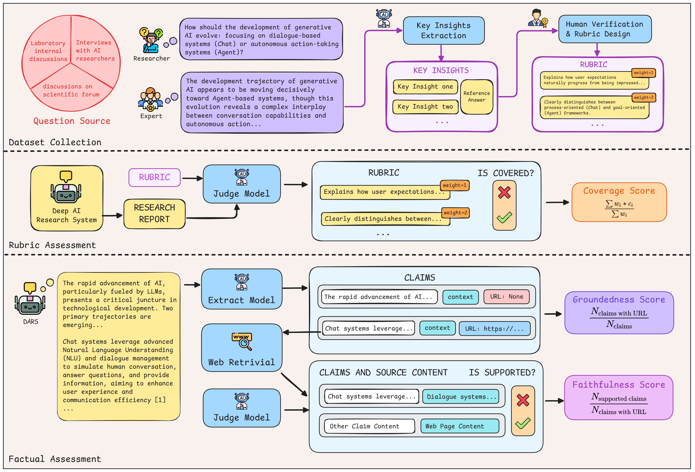
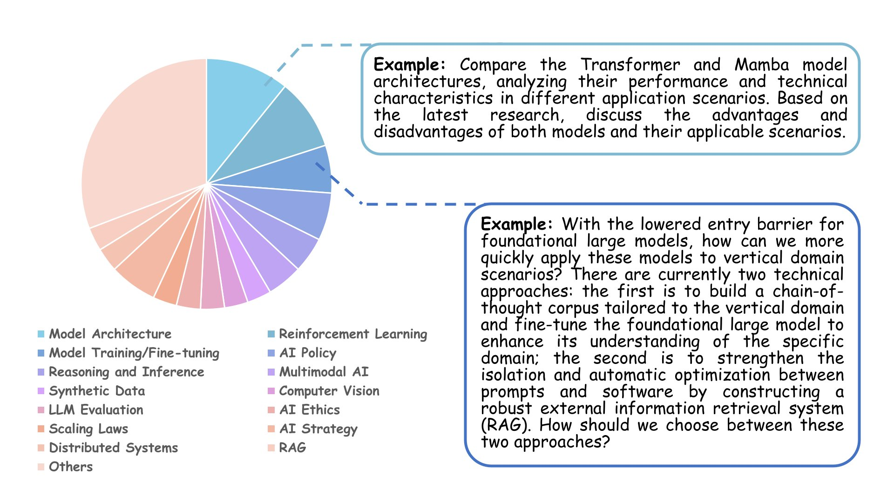
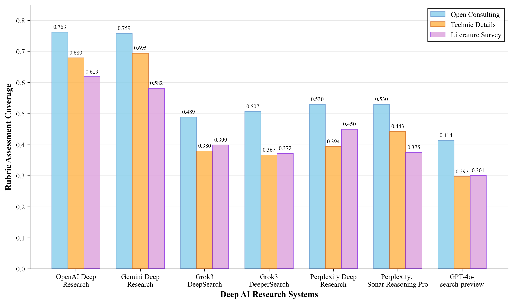

<h1 align="center">ResearcherBench: Evaluating Deep AI Research Systems on the Frontiers of Scientific Inquiry</h1>

<p align="center">
📄 <a href="https://arxiv.org/abs/2507.16280" target="_blank">Paper</a> &nbsp; | &nbsp;
    💻 <a href="https://github.com/GAIR-NLP/ResearcherBench" target="_blank">Code</a> &nbsp; | &nbsp;
    🌐 <a href="https://researcherbench.github.io/" target="_blank">Website</a>
</p>

<h5 align="center"> If you like our project, please give us a star ⭐ on GitHub for the latest update.</h5>




## 📋 Contents

- [🎯 **Overview**](#-overview)
- [🏗️ Benchmark Construction](#️-benchmark-construction)
- [🔬 Evaluation Framework](#-evaluation-framework)
- [📊 Evaluation Results](#-evaluation-results)
- [🚀 **Quick Start**](#-quick-start)
- [📁 Project Structure](#-project-structure)
- [📋 Data Formats](#-data-formats)
- [📚 Citation](#-citation)

## 🎯 Overview

As Deep AI Research Systems (DARS) become increasingly sophisticated, there is a growing need for evaluation methodologies that can assess their potential as genuine research partners rather than just information retrieval tools. ResearcherBench is a comprehensive evaluation benchmark specifically designed to assess DARS capabilities on frontier scientific questions by providing:

- **Frontier Research Question Dataset**: 65 expertly curated research questions from authentic scientific scenarios, spanning 35 distinct AI research subjects
- **Dual Evaluation Framework**: Combines expert-designed rubric assessment for insight quality with factual assessment for citation accuracy and reliability
- **Comprehensive DARS Evaluation**: Systematic assessment of leading commercial systems to understand current capabilities and limitations

## 🏗️ Benchmark Construction

### Data Collection Strategy

ResearcherBench employs a rigorous data collection methodology to ensure authenticity and quality of frontier research questions. We identified three primary contexts that consistently generate high-quality frontier research questions:

1. **Laboratory Internal Research Discussions**: Where researchers actively grapple with unsolved technical challenges
2. **Interviews with Leading AI Researchers**: Revealing emerging research directions and open problems  
3. **Scientific Forum Discussions**: Where practitioners discuss implementation challenges and theoretical gaps


### Dataset Composition


We compiled a dataset of 65 research questions expertly selected from real-world scientific scenarios such as laboratory discussions and interviews across 35 different AI subjects (e.g. Model Architecture, Reinforcement Learning, AI Policy and Ethics), categorized into three types: Technical Details, Literature Review, and Open Consulting.




## 🔬 Evaluation Framework

ResearcherBench introduces a dual evaluation framework that comprehensively assesses DARS performance through both **rubric assessment** and **factual assessment**. We combine expert-designed criteria evaluation with automated factual verification to capture both the depth of understanding and the reliability of generated research content.

### **1. Rubric Assessment**

- **Key Insight Extraction**: We employ Claude-3.7-Sonnet to analyze from multiple diverse contextual sources, and extract key insights that require deep thinking and cross-domain synthesis. This automated extraction process generates comprehensive reference materials that contain high-value insights, which then serve as auxiliary materials for human expert annotation.

- **Human Expert Rubric Design**: Experienced researchers transform extracted insights into weighted evaluation criteria (1-3 scale), creating a structured framework that captures the breadth and depth of expected research contributions.

- **Assessment Methodology**: For each question, we evaluate whether DARS responses cover the key insights specified in the expert-designed rubric and calculate the weighted coverage score for these responses.

### **2. Factual Assessment**

- **Claim Extraction**: We employ an extract model to extract all factual claims within DARS-generated reports along with their corresponding context passages. The Extract Model also examines whether each claim can be retrieved with a corresponding citation URL from the report.

- **Citation Support Verification**: For each URL-claim-context triplet, we extract textual content from the URL source, then use a judge model to perform binary evaluation of whether the extracted content supports the corresponding claim. 

- **Assessment Methodology**: We compute two metrics to assess different aspects of factual accuracy. The Faithfulness score measures the accuracy of citations in supporting their corresponding claims, and the Groundedness score evaluates the overall citation coverage of response content.

## 📊 Evaluation Results

### Main Performance

Our evaluation of leading Deep AI Research Systems reveals significant insights about their current capabilities:

| **Model** | **Coverage** | **Faithfulness** | **Groundedness** |
|-------|:------:|:------:|:------:|
| ***Deep AI Research System*** |  |  |  |
| OpenAI Deep Research | **0.7032** | 0.84 | 0.34 |
| Gemini Deep Research | 0.6929 | **0.86** | 0.59 |
| Grok3 DeepSearch | 0.4414 | 0.69 | 0.32 |
| Grok3 DeeperSearch | 0.4398 | 0.80 | 0.31 |
| Perplexity Deep Research | 0.4800 | 0.85 | 0.56 |
| ***LLM with Search Tools*** |  |  |  |
| GPT-4o Search Preview | 0.3576 | 0.86 | 0.39 |
| Perplexity: Sonar Reasoning Pro | 0.4663 | 0.62 | **0.68** |


### Performance Across Question Types

As illustrated in the Figure below, all systems demonstrate better performance on open-ended consulting questions compared to other categories, with top systems achieving 76%+ coverage rates. The superior performance on Open Consulting questions validates our hypothesis that DARS systems are particularly effective as innovative research ideation partners rather than precision technical implementation guide.




### Critical Insights
- **DARS as Research Ideation Partners**: All evaluated systems perform better on open consulting questions compared to other question types, suggesting DARS should be leveraged primarily for early-stage research planning, novel research direction identification, and conceptual analysis in frontier domains.
- **Synthesis Over Retrieval**: High groundedness doesn't necessarily correlate with research quality for frontier questions, valuable research insights often emerge from creative connections and analytical reasoning rather than explicit citation-backed claims

## 🚀 Quick Start

### Step 1: Environment Setup
```bash
# Install required dependencies
git clone https://github.com/GAIR-NLP/ResearcherBench.git
cd ResearcherBench

# Install dependencies
pip install -r requirements.txt

# Set up environment variables
export OPENAI_API_KEY="your-openai-api-key"
export OPENAI_BASE_URL="https://api.openai.com/v1" 
export JINA_API_KEY="your-jina-api-key"  # For web content extraction
```

### Step 2: Prepare Your Data
You should prepare your responses of DARS in the [target format](#format).

```bash
# Add your model responses to data/user_data/
cp your_model_responses.json data/user_data/<model_name>.json

# Edit the model name in environment variables
export MODEL=<model_name>
```

### Step 3: Run Evaluation
```bash
./eval.sh
```

### Step 4: View Results
```bash
# Check results directory
ls results/

# View rubric evaluation summary
cat results/rubric_eval/<model_name>/<model_name>_evaluation_results.txt

# View factual evaluation summary
cat results/factual_eval/<model_name>/factual_analysis.json
```

### Output Files
Results will be saved to:
- **Factual Assessment Result** in `results/factual_eval/<model_name>/factual_analysis.json`, details in `results/factual_eval/<model_name>/factual_results.json`
- **Rubric Assessment Result** in `results/rubric_eval/<model_name>/<model_name>_evaluation_results.txt`, details in `results/rubric_eval/<model_name>/<model_name>_evaluation_results.json`


### Evaluation Pipeline Overview
```
1. Data Preparation → 2. Rubric Assessment → 3. Factual Assessment → 4. Results Analysis
      ↓                      ↓                        ↓                       ↓
  Your Model        Judge Model Evaluation        Claim Extraction &        Comprehensive
  Responses    →    Against Expert Rubrics   →   Citation Verification  →  Performance Report
``` 

## 📁 Project Structure

```
ResearcherBench/
├── data/
│   ├── eval_data/
│   │   ├── rubric.json              # Expert-designed evaluation rubrics
│   │   └── questions.json           # 65 frontier research questions
│   └── user_data/                   # Model response files
│       ├── <model_name>.json        # Your model responses
│       └── ...
├── code/
│   ├── rubric_eval/                 # Rubric-based evaluation
│   │   ├── evaluator.py             # Core evaluation logic
│   │   ├── main.py                  # Execution script
│   │   └── report/                  # Report generation
│   └── faithfulness_eval/           # Faithfulness evaluation
│       ├── faithful_evaluator.py    # Faithfulness assessment
│       ├── faithfulness_script.py   # Execution script
│       └── config.py                # Configuration management
├── results/                         # Evaluation outputs
│   ├── rubric_eval/                 # Coverage evaluation results
│   │   └── <model_name>/            # Model-specific rubric results
│   ├── factual_eval/                # Faithfulness evaluation results
│   │   └── <model_name>/            # Model-specific factual results
│   ├── claims/                      # Extracted claims for verification
│   └── logs/                        # Evaluation logs
├── eval.sh                          # Main evaluation script
├── requirements.txt                 # Dependencies
└── README.md                        # This file
```

## 📋 Data Formats

### DARS Response Format Example:<a id="format"></a>

```json
[
    {
        "id": 1,
        "question": "What are the latest developments in quantum computing?",
        "response": "Recent advances in quantum computing include... [1]"
    },
    {
        "id": 2,
        "question": "How does machine learning impact healthcare?",
        "response": "Machine learning is revolutionizing healthcare through... [1]"
    }
    ... (Totally 65 items)
]
```


## 📚 Citation

If you use ResearcherBench in your research, please cite our paper:

```bibtex
@misc{xu2025researcherbenchevaluatingdeepai,
      title={ResearcherBench: Evaluating Deep AI Research Systems on the Frontiers of Scientific Inquiry}, 
      author={Tianze Xu and Pengrui Lu and Lyumanshan Ye and Xiangkun Hu and Pengfei Liu},
      year={2025},
      eprint={2507.16280},
      archivePrefix={arXiv},
      primaryClass={cs.AI},
      url={https://arxiv.org/abs/2507.16280}, 
}
```
